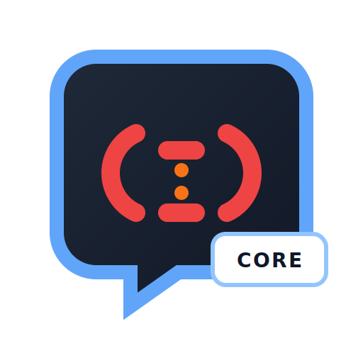

# @bf-i18n/core

[](https://github.com/usapopopooon/bf-i18n/actions/workflows/ci.yml)
[](https://www.npmjs.com/package/@bf-i18n/core)
[](https://opensource.org/licenses/MIT)

<p align="center">
  
</p>

A lightweight, framework-agnostic i18n library that supports Rails and Laravel translation formats for JavaScript/TypeScript applications.

Part of the [bf-i18n](https://github.com/usapopopooon/bf-i18n) project.

## Installation

```bash
npm install @bf-i18n/core
```

## Features

- Rails mode (`%{variable}` interpolation, key-based pluralization)
- Laravel mode (`:variable` interpolation, pipe-based pluralization)
- Automatic format conversion between modes
- Browser locale detection
- Missing key tracking
- TypeScript support

## Usage

```typescript
import { createI18n } from '@bf-i18n/core';

const i18n = createI18n({
  defaultLocale: 'en',
  mode: 'rails', // or 'laravel'
  translations: {
    en: {
      greeting: 'Hello, %{name}!',
      items: {
        zero: 'No items',
        one: '1 item',
        other: '%{count} items',
      },
    },
    ja: {
      greeting: 'こんにちは、%{name}さん！',
      items: {
        other: '%{count}個のアイテム',
      },
    },
  },
});

// Basic translation
i18n.t('greeting', { name: 'World' }); // "Hello, World!"

// Pluralization
i18n.t('items', { count: 0 }); // "No items"
i18n.t('items', { count: 1 }); // "1 item"
i18n.t('items', { count: 5 }); // "5 items"

// Change locale
i18n.locale = 'ja';
i18n.t('greeting', { name: 'World' }); // "こんにちは、Worldさん！"

// Listen to locale changes
i18n.onLocaleChange((newLocale, oldLocale) => {
  console.log(`Locale changed from ${oldLocale} to ${newLocale}`);
});
```

## Browser Locale Detection

```typescript
import { createI18n, detectBrowserLocale } from '@bf-i18n/core';

// Auto-detect browser locale
const i18n = createI18n({
  defaultLocale: 'en',
  detectBrowserLocale: true,
  translations: { /* ... */ },
});

// Or detect manually
const browserLocale = detectBrowserLocale({
  availableLocales: ['en', 'ja', 'fr'],
  fallback: 'en',
});
```

## API

### `createI18n(options)`

Creates a new I18n instance.

**Options:**
- `defaultLocale` - Default locale to use
- `mode` - `'rails'` or `'laravel'`
- `translations` - Translation data object
- `detectBrowserLocale` - Auto-detect browser locale (default: false)

### `I18n` instance methods

- `t(key, options?)` - Translate a key
- `locale` - Get/set current locale
- `hasLocale(locale)` - Check if locale exists
- `onLocaleChange(callback)` - Listen to locale changes
- `getMissingKeys()` - Get tracked missing keys
- `clearMissingKeys()` - Clear missing keys
- `hasMissingKeys()` - Check if there are missing keys

## License

MIT
